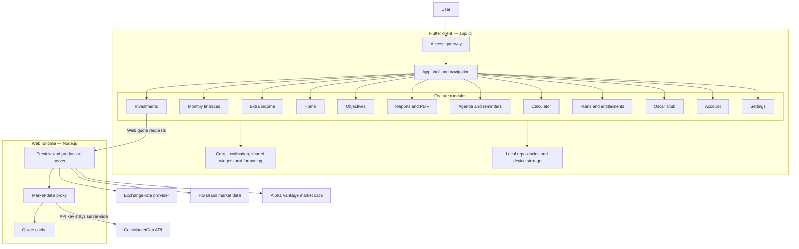

# Oscar Finanças

<p align="center">
  <strong>One clear view of your money, plans, and investments.</strong><br>
  A modular personal finance app built with Flutter for people who want to understand their financial life and make more intentional decisions.
</p>

<p align="center">
  <a href="https://oscar-financas.onrender.com">Live demo</a> ·
  <a href="https://youtu.be/qmpPuyVduhg">Product walkthrough</a> ·
  <a href="https://dorahacks.io/buidl/49196">Build with CMC submission</a>
</p>

> Oscar Finanças started as an idea on paper. The CoinMarketCap API hackathon became the push to turn it into a working product. Today, it brings everyday budgeting, investment tracking, financial goals, and market context into one experience.

## Why Oscar Finanças

Personal finance information often lives in separate places: monthly spending in one app, investments in another, and plans in a spreadsheet. Oscar Finanças is designed to connect those everyday views. Track the month, understand how assets affect your overall picture, set goals, and revisit progress through reports and reminders.

The app is organized around practical financial workflows rather than a single dashboard. Its home screen summarizes the broader picture, while focused modules handle transactions, additional income, investments, objectives, reports, planning, and preferences.

## Product tour

The app has an entry experience and 12 navigable destinations. Features that depend on a plan can show an access notice when the active tier does not allow an action.

| Screen | What it does |
| --- | --- |
| **Welcome & access** | Introduces the app and presents available entry options, including guest access. Sign-in options are shown where configured; this repository does not implement a remote account or cloud-sync backend. |
| **Home** | Brings together the monthly financial picture, investment breakdown, objective progress, and shortcuts into the main workflows. |
| **Monthly finances** | Records and reviews income and expenses by month, supports recurring/installment-aware transactions, and presents summaries, expense distribution, and the Oscar Score. |
| **Extra income** | Tracks additional-income entries and contributions, with month selection and currency-aware amounts. |
| **Investments** | Organizes portfolio positions across asset classes, shows holdings and allocation, and adds market quotes and historical context where data is available. |
| **Financial objectives** | Creates and monitors savings targets and progress, connecting a goal to financial activity and portfolio context. |
| **General reports** | Builds monthly, 3-month, 6-month, and annual financial reports, including income, expenses, assets, crypto, and goals; supports report viewing and PDF export/printing. |
| **Agenda** | Keeps dated financial events and reminders in one calendar workflow, with configurable notification timing where the platform supports it. |
| **Calculator** | Projects compound growth from contribution, rate, and time assumptions to explore possible investment outcomes. |
| **Plans** | Explains Basic, Plus, and Pro access levels and the capabilities associated with each tier. |
| **Oscar Club** | Presents a locally defined catalog of partner offers and categories. |
| **Account** | Stores a local profile and provides access to the app's legal documents and current plan information. |
| **Settings** | Controls locale, currency, region, agenda reminders, privacy/display preferences, and personal-history reset. |

The interface includes localization support for Brazilian Portuguese, English, French, German, and Hindi. Brazilian Portuguese remains the primary product language; this README is in English for an international developer and judging audience.

## Architecture

The Flutter application is divided by product capability. Feature modules use presentation, application, domain, and data layers where appropriate; shared app setup, navigation, localization, formatting, and reusable widgets live outside those modules.



### Layer responsibilities

| Layer | Responsibility |
| --- | --- |
| `app/lib/app/` | App bootstrap, navigation shell, theme, preferences, service wiring, and platform-specific service selection. |
| `app/lib/features/<feature>/presentation/` | Screens and UI components for each user workflow. |
| `app/lib/features/<feature>/application/` | View models, workflow coordination, services, and ports between UI and data. |
| `app/lib/features/<feature>/domain/` | Financial entities, value objects, repository contracts, and business rules. |
| `app/lib/features/<feature>/data/` | SQLite/local implementations, API adapters, file generation, and integration details. |
| `app/lib/core/` and `app/lib/shared/` | Shared money/time primitives, localization, controllers, formatting, scroll behavior, and reusable widgets. |
| `tools/` | Node.js preview server and web market-data proxy; server secrets are configured outside source control. |

### Market-data flow

On the web, the Flutter client requests quotes from same-origin `/api/...` endpoints. The Node.js server calls the upstream providers, keeps API credentials on the server, and caches supported responses. Investment data routes by asset type: CoinMarketCap for crypto, HG Brasil for Brazilian-listed positions, and Alpha Vantage for global market data. Currency conversion uses the configured exchange-rate provider. On native builds, provider access follows the app's configured service path; do not embed production secrets in a distributed client.

## Data, privacy, and current scope

- Personal finance records are stored locally through platform-specific repositories. Web financial data is kept in the user's browser; this setup does not synchronize personal data between devices.
- The account/profile experience is local. A sign-in screen or entry option should not be interpreted as a complete hosted identity, backup, or cross-device sync service.
- Market prices depend on upstream provider availability, API configuration, and cache freshness. A missing or unavailable quote does not mean the underlying holding has been removed.
- Plan descriptions and entitlement checks exist in the app. A production billing backend or verified store purchase should only be claimed when it is configured for the target release.
- The free Render service may sleep after inactivity; its local server cache can be cleared when the service restarts. Persistent hosting/storage requires separate configuration.

## Run locally

### Requirements

- Flutter SDK compatible with the constraint in `app/pubspec.yaml`
- Dart bundled with Flutter
- Node.js 24 for the web preview/proxy
- Android SDK for Android builds

### Analyze and run the Flutter app

```powershell
cd app
flutter pub get
flutter analyze
flutter test
flutter run
```

### Run the web app with its API proxy

Build the Flutter web assets first, then start the Node.js server from the repository root:

```powershell
cd app
flutter build web --release
cd ..
node tools/serve_web_preview.mjs
```

The preview server reads API keys from environment variables or documented local-only files under the user's local application data directory. Never commit API keys or paste them into Flutter source. For a full deployed web build, use the repository's `Dockerfile` and `render.yaml`; the Node server must be present so same-origin market-data endpoints work.

### Build Android

```powershell
cd app
flutter build appbundle --release
```

## Repository map

```text
app/
  lib/
    app/                 # Bootstrap, navigation, theme, services
    core/                # Shared domain primitives and localization
    features/            # One module per product capability
    shared/              # Reusable UI, controllers, and formatting
  assets/                # Brand artwork and fonts
  test/                  # Flutter unit and widget tests
tools/                   # Node.js preview server and market-data proxy
Dockerfile               # Multi-stage Flutter Web + Node runtime image
render.yaml              # Render service definition
```

## Project status

Oscar Finanças is an actively developed personal-finance product and a public hackathon submission. The repository documents the current implementation; availability of a provider, native integration, billing option, or deployment can vary by platform and environment. See the live demo and walkthrough linked above for the current product presentation.

## Security

- Keep API keys, OAuth secrets, signing files, and local environment files out of Git.
- Store server-side provider keys in the deployment platform's secret environment variables.
- Use fictional data and dedicated test accounts when demonstrating financial workflows.
- Review third-party asset and dependency licenses before redistribution.

## License

No open-source license is currently declared in this repository. Unless a license is added, the source remains subject to the default copyright rules; do not assume it is available for reuse or redistribution.
